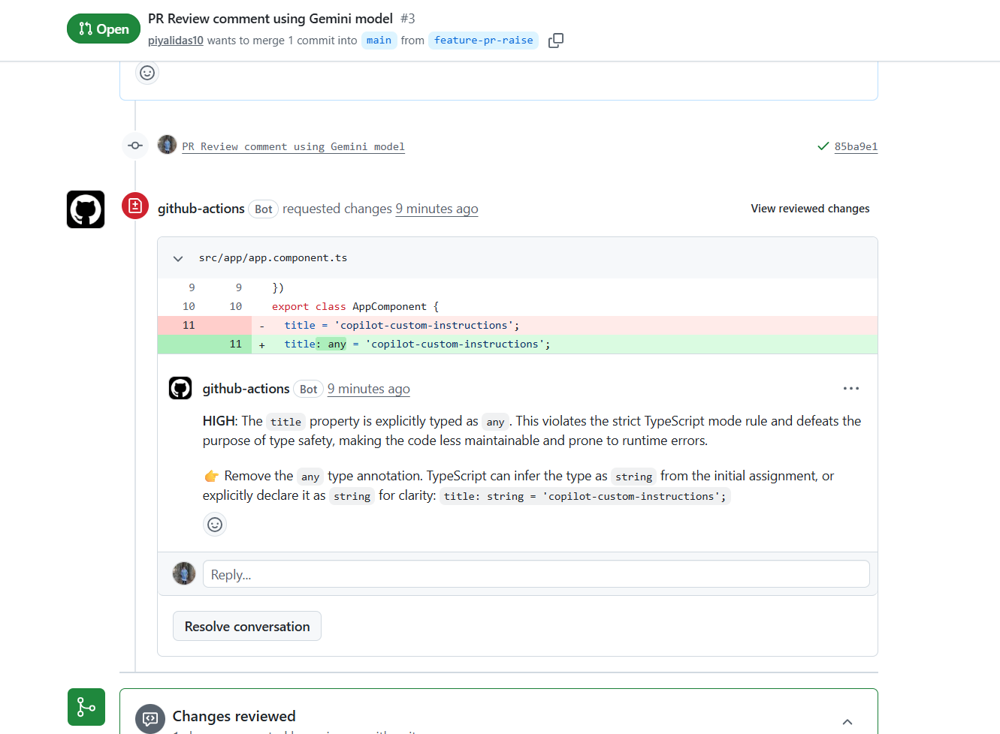

# AI reviewer using Google Gemini
PR link : https://github.com/piyalidas10/Copilot/pull/3
Actions link : https://github.com/piyalidas10/Copilot/actions/runs/25284106483/job/74125751806



## 🔐 Where GEMINI_API_KEY is actually stored

**You must add it in GitHub:**

👉 Steps
1. Go to your repo
2. Click Settings
3. Go to Secrets and variables → Actions
4. Click New repository secret
5. Add:
```
Name: GEMINI_API_KEY
Value: your_api_key_here
```

**⚙️ How it reaches your code**

In your workflow:
```
env:
  GEMINI_API_KEY: ${{ secrets.GEMINI_API_KEY }}
```
👉 This injects the secret into runtime

## you want to use Gemini 3.1 Flash (free tier) inside your GitHub PR reviewer pipeline.

That’s actually a great choice for CI:
- ⚡ Fast
- 💸 Free / low-cost
- 🧠 Good enough for code review

Let’s wire it properly 👇

**🚀 1. Architecture (Gemini in CI)**
```
PR → GitHub Actions → Diff → Gemini API → JSON Review → Inline PR Comments
```

**⚙️ 2. GitHub Workflow (READY TO USE)**

Alright—here’s a clean, production-grade, full gemini-review.js that includes everything we discussed:

✅ Dynamic model detection (uses your available Gemini models)  
✅ Token-safe prompt trimming 
✅ Strong prompt constraints (max 5 issues) 
✅ Handles MAX_TOKENS truncation  
✅ JSON recovery (critical for CI stability)  
✅ Safe parsing + fallback (never breaks pipeline)  
✅ Output always written to comments.json 
✅ Only reviews Angular files (*.ts)  
✅ Ensures diff actually exists 
✅ Prevents empty/irrelevant reviews  

**📄 Main file that defines Angular rules**
```
.github/copilot-instructions.md
```

📁 .github/workflows/gemini-review.yml
```
name: AI PR Review (Gemini)

on:
  pull_request:
    types: [opened, synchronize, reopened]

permissions:
  contents: read
  pull-requests: write

jobs:
  review:
    runs-on: ubuntu-latest

    steps:
      - uses: actions/checkout@v4

      # ✅ Get ONLY Angular/TS diff
      - name: Get Angular diff
        run: |
          git fetch origin ${{ github.base_ref }}

          git diff --unified=0 origin/${{ github.base_ref }} -- '*.ts' \
            | head -c 12000 > diff.txt

          echo "---- DIFF START ----"
          cat diff.txt
          echo "---- DIFF END ----"

      # ❌ Skip if no relevant changes
      - name: Check if diff is empty
        id: check_diff
        run: |
          if [ ! -s diff.txt ]; then
            echo "empty=true" >> $GITHUB_OUTPUT
          else
            echo "empty=false" >> $GITHUB_OUTPUT
          fi

      # 🚫 Skip AI if no Angular changes
      - name: Skip AI Review (no Angular changes)
        if: steps.check_diff.outputs.empty == 'true'
        run: echo "✅ No Angular changes to review"

      # 🤖 Run AI Review
      - name: Run Gemini PR Review
        if: steps.check_diff.outputs.empty != 'true'
        env:
          GEMINI_API_KEY: ${{ secrets.GEMINI_API_KEY }}
        run: node gemini-review.js

      # 🧪 Debug output
      - name: Debug comments
        if: steps.check_diff.outputs.empty != 'true'
        run: cat comments.json

      # 💬 Post PR comments
      - name: Post Inline Comments
        if: steps.check_diff.outputs.empty != 'true'
        uses: actions/github-script@v7
        with:
          script: |
            const fs = require('fs');

            let comments = JSON.parse(fs.readFileSync('comments.json', 'utf8'));

            if (!comments.length) {
              console.log("✅ No issues found");
              return;
            }

            // ✅ sanitize comments (VERY IMPORTANT)
            comments = comments
              .filter(c => c.file && c.line && c.line > 0)
              .map(c => ({
                path: c.file.replace(/^\/+/, ""),
                line: c.line,
                body: `**${c.severity}**: ${c.comment}\n\n👉 ${c.suggestion}`
              }));

            if (!comments.length) {
              console.log("⚠️ No valid comments after filtering");
              return;
            }

            try {
              await github.rest.pulls.createReview({
                owner: context.repo.owner,
                repo: context.repo.repo,
                pull_number: context.issue.number,
                event: "REQUEST_CHANGES",
                comments
              });
            } catch (e) {
              console.log("❌ Inline comments failed, falling back");

              // 🔁 fallback to normal comment (never lose output)
              const body = comments.map(c => 
                `**${c.path}:${c.line}**\n${c.body}`
              ).join("\n\n");

              await github.rest.issues.createComment({
                issue_number: context.issue.number,
                owner: context.repo.owner,
                repo: context.repo.repo,
                body: "## 🤖 AI Review\n\n" + body
              });
            }
```

**🧠 3. Gemini Review Script**

📁 gemini-review.js
```
import fs from "fs";

// ===============================
// 📥 Read Inputs
// ===============================
const diff = fs.readFileSync("diff.txt", "utf8") || "";
const rules =
  fs.readFileSync(".github/copilot-instructions.md", "utf8") || "";

// 🔥 Trim to avoid token overflow
const trimmedDiff = diff.slice(0, 5000);
const trimmedRules = rules.slice(0, 1200);

// ===============================
// 🧠 Prompt
// ===============================
const prompt = `
You are a senior Angular reviewer.

Follow these rules strictly:
${trimmedRules}

Review this git diff:
${trimmedDiff}

IMPORTANT:
- Return ONLY valid JSON
- DO NOT use markdown
- DO NOT wrap in \`\`\`
- DO NOT add explanation
- Return MAXIMUM 5 issues

Return format:
[
  {
    "file": "relative/path/file.ts",
    "line": 10,
    "severity": "HIGH|MEDIUM|LOW",
    "comment": "Clear explanation",
    "suggestion": "Concrete fix"
  }
]
`;

// ===============================
// 🔍 Detect Available Model
// ===============================
async function getModel() {
  try {
    const res = await fetch(
      `https://generativelanguage.googleapis.com/v1/models?key=${process.env.GEMINI_API_KEY}`
    );
    const data = await res.json();

    const names = data.models?.map((m) => m.name) || [];

    console.log("🔍 Available models:", names);

    const preferred = [
      "models/gemini-2.5-flash",
      "models/gemini-2.0-flash",
      "models/gemini-2.0-flash-lite"
    ];

    for (const p of preferred) {
      if (names.includes(p)) {
        return p.replace("models/", "");
      }
    }

    throw new Error("No supported Gemini model available");
  } catch (e) {
    console.error("❌ Model detection failed:", e.message);
    process.exit(1);
  }
}

// ===============================
// 🚀 Main Execution
// ===============================
async function run() {
  try {
    const model = await getModel();
    console.log("🚀 Using model:", model);

    const response = await fetch(
      `https://generativelanguage.googleapis.com/v1/models/${model}:generateContent?key=${process.env.GEMINI_API_KEY}`,
      {
        method: "POST",
        headers: { "Content-Type": "application/json" },
        body: JSON.stringify({
          contents: [{ parts: [{ text: prompt }] }],
          generationConfig: {
            temperature: 0.2,
            maxOutputTokens: 2048
          }
        })
      }
    );

    const data = await response.json();

    console.log(
      "🔍 FULL GEMINI RESPONSE:\n",
      JSON.stringify(data, null, 2)
    );

    // ===============================
    // ❌ API Error Handling
    // ===============================
    if (data.error) {
      console.error("❌ Gemini API error:", data.error.message);
      fs.writeFileSync("comments.json", "[]");
      return;
    }

    // ===============================
    // 📤 Extract Response Text
    // ===============================
    let rawText = "";

    if (data.candidates?.length > 0) {
      const parts = data.candidates[0]?.content?.parts;
      if (parts?.length > 0) {
        rawText = parts.map((p) => p.text || "").join("\n");
      }
    } else if (data.promptFeedback) {
      console.error("⚠️ Gemini blocked response:", data.promptFeedback);
    }

    if (!rawText) {
      console.error("❌ Empty Gemini response");
      fs.writeFileSync("comments.json", "[]");
      return;
    }

    console.log("🔍 Raw response:\n", rawText);

    // ===============================
    // 🧹 Clean Markdown (if any)
    // ===============================
    const cleanText = rawText
      .replace(/```json/g, "")
      .replace(/```/g, "")
      .trim();

    let comments = [];

    // ===============================
    // 🔥 JSON Parse + Recovery
    // ===============================
    try {
      comments = JSON.parse(cleanText);
    } catch (err) {
      console.error("❌ JSON parse failed — attempting recovery");

      const start = cleanText.indexOf("[");
      const end = cleanText.lastIndexOf("]");

      if (start !== -1 && end !== -1 && end > start) {
        const recovered = cleanText.substring(start, end + 1);

        try {
          comments = JSON.parse(recovered);
          console.log("✅ Partial JSON recovered");
        } catch (e) {
          console.error("❌ Recovery failed");
          fs.writeFileSync("comments.json", "[]");
          return;
        }
      } else {
        console.error("❌ No valid JSON structure found");
        fs.writeFileSync("comments.json", "[]");
        return;
      }
    }

    // ===============================
    // ✅ Validate Comments
    // ===============================
    comments = comments.filter(
      (c) =>
        c &&
        typeof c.file === "string" &&
        c.file.length > 0 &&
        Number.isInteger(c.line) &&
        c.line > 0
    );

    // Normalize severity
    comments = comments.map((c) => ({
      ...c,
      severity: (c.severity || "LOW").toUpperCase()
    }));

    console.log(`✅ Generated ${comments.length} review comments`);

    // ===============================
    // 💾 Save Output
    // ===============================
    fs.writeFileSync(
      "comments.json",
      JSON.stringify(comments, null, 2)
    );
  } catch (error) {
    console.error("❌ Fatal error:", error.message);
    fs.writeFileSync("comments.json", "[]");
  }
}

// ===============================
run();
```

In your gemini-review.js, you have this line:
```
const rules = fs.readFileSync(".github/copilot-instructions.md", "utf8");
```
👉 That means: Whatever is written in copilot-instructions.md = rules for AI reviewer

**🔐 4. Add Secret**

Go to GitHub repo:

👉 Settings → Secrets → Actions

Add:
```
GEMINI_API_KEY
```

⚠️ IMPORTANT (model name)

Use:
```
gemini-1.5-flash
```
(Current official free/fast model)

**🔥 5. Make it Production-Ready**

✅ Limit token usage

Replace diff:
```
git diff --unified=0 origin/main > diff.txt
```

**✅ Add PR blocking**
```
- name: Block on HIGH issues
  run: |
    if grep -q '"severity": "HIGH"' comments.json; then
      echo "❌ High severity issues found"
      exit 1
    fi
```

**✅ Add fallback (important)**

If Gemini fails:
```
if (!comments.length) {
  console.log("Fallback: no comments generated");
}
```

**🧠 Real-world tips (important)**

❌ Gemini limitations
- Less accurate than GPT-4 / Claude
- May hallucinate line numbers
- Needs strong prompt

✅ Best practice

Use hybrid:
```
ESLint + Gemini AI + PR Template
```

**🚀 Final Result**

You now have:   
✅ Free AI reviewer 
✅ Inline comments per file 
✅ Angular-aware feedback   
✅ CI integration   
✅ PR blocking capability   